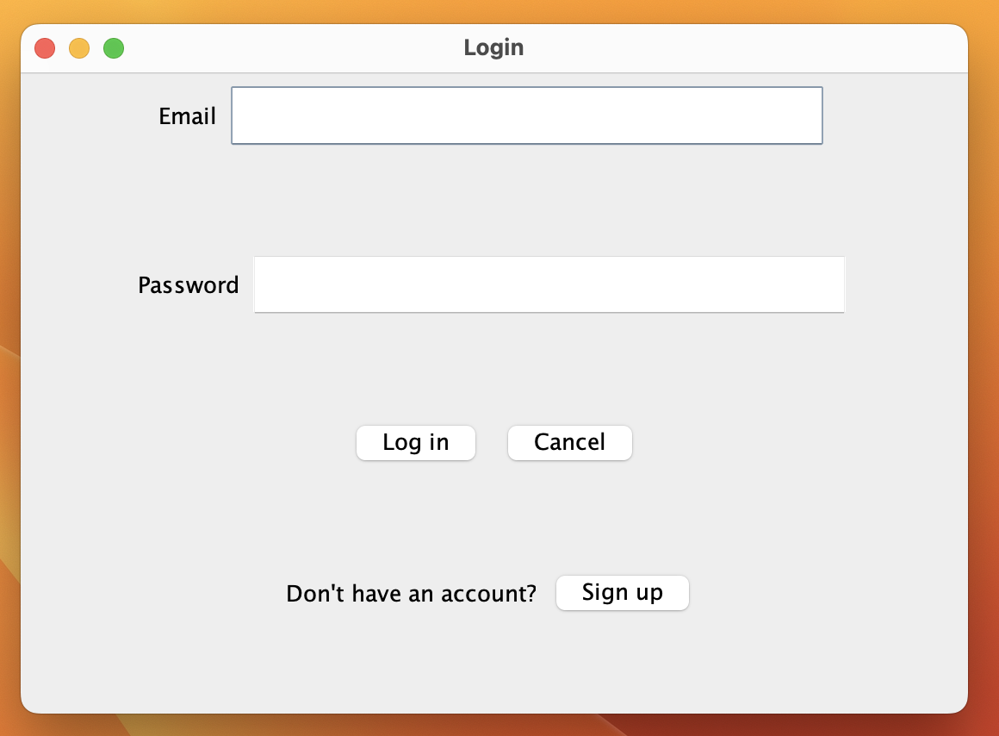
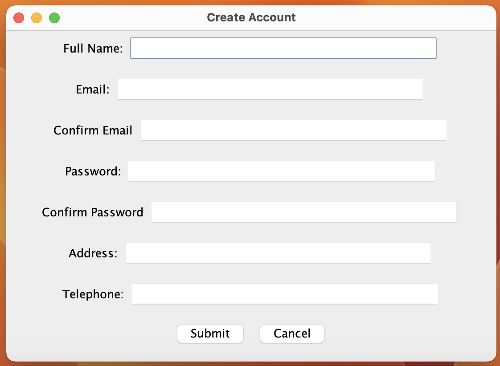
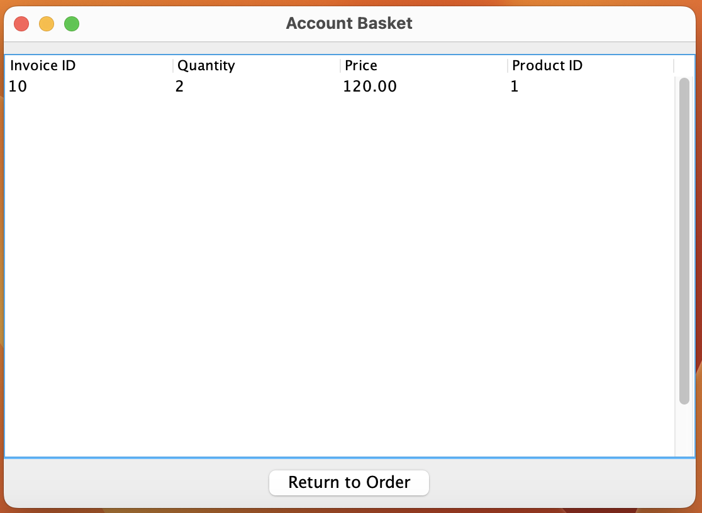
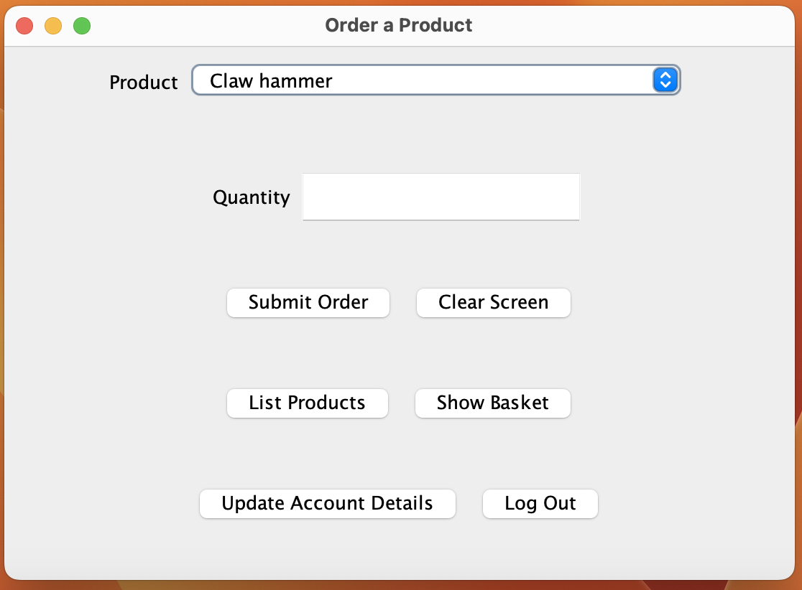
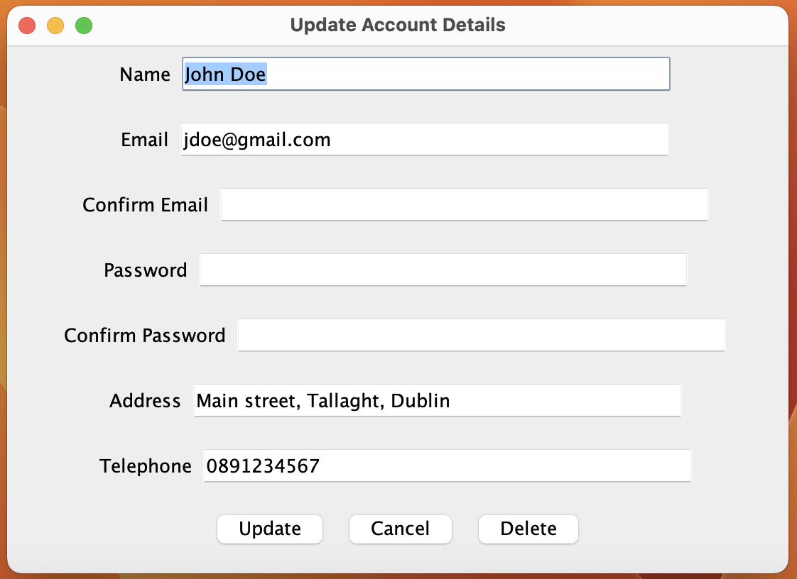
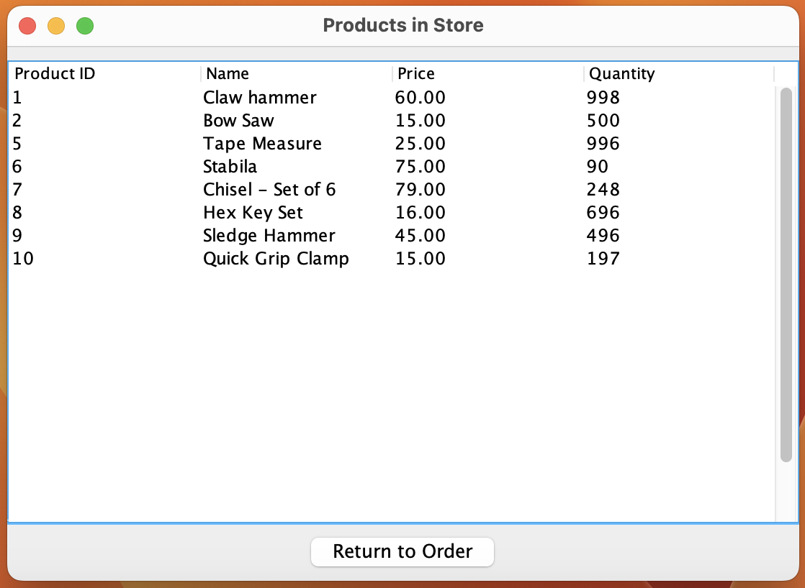
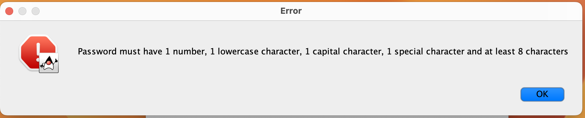

# Customer Invoice Management System

## Objective
A CRUD GUI to allow customers to:
* Create an account
* login to that account
* Create an order
* View order history
* View products for sale in the hardware
* Update the details in their account
* Delete their account

## Built using
* GUI uses Java.Swing
* Database is managed using SQL
* PBKDF2 as a hashing algorithm for the users password

## Screenshots

